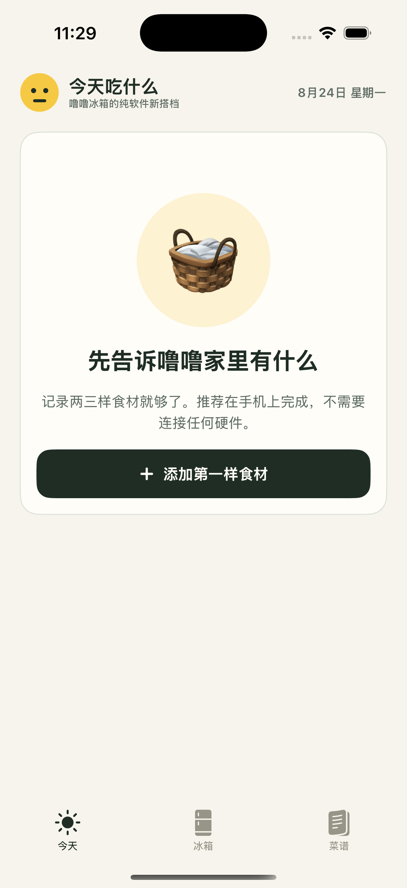
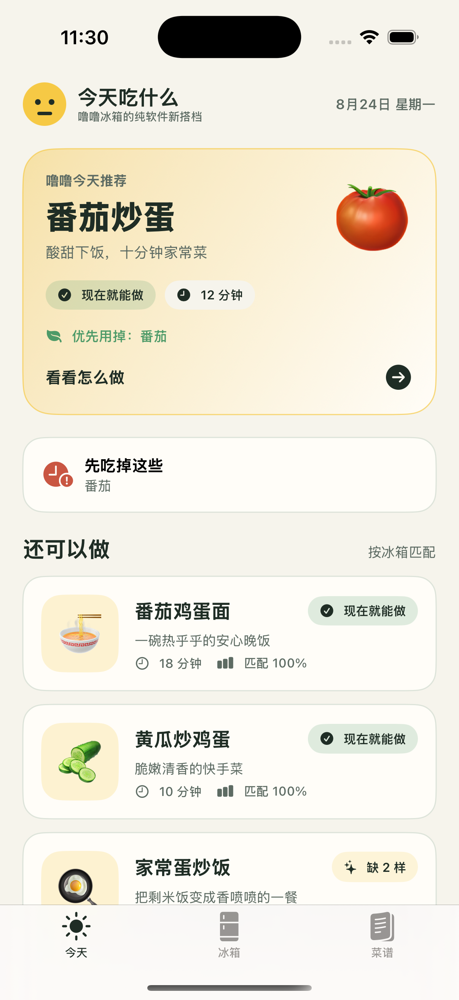
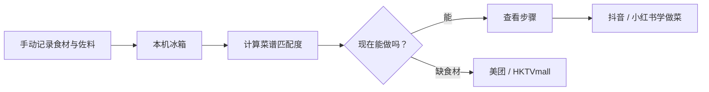

<div align="center">
  
  <h1>今天吃什么</h1>
  <p><strong>打开冰箱，就知道今天能吃什么。</strong></p>
  <p>
    
    
    
    
    
  </p>
  <p>
    一个亲切、轻松的本地优先 iPhone App。记录家里的食材和佐料，得到真正能做的菜；缺什么就去买，不会做就去学。
  </p>
</div>

<p align="center">
  
  &nbsp;&nbsp;
  
</p>

## 为什么做它

每天最难回答的，往往不是“有哪些菜”，而是“用我现在拥有的东西，能做什么”。“今天吃什么”把这个问题变成一个短而完整的闭环：库存留在手机里，推荐在设备端完成，学习和采购交给你熟悉的平台。



## 第一版能做什么

| 场景 | 已实现能力 |
|---|---|
| 记录冰箱 | 62 个常用食材与佐料、分区展示、自定义名称、数量、单位和保质期 |
| 管理库存 | 本地持久化、数量增减和删除；不需要账号或服务器 |
| 决定吃什么 | 36 道内置家常菜，主食材与佐料均参与匹配、缺料和排序 |
| 查看做法 | 2 人份用料、当前库存核对、分步做法和烹饪提示 |
| 学做菜 | 携带菜名跳转抖音或小红书搜索，未安装时回退网页 |
| 购买缺料 | 汇总缺少的食材，跳转美团或 HKTVmall 搜索 |
| 为拍照做准备 | 已保留单个食材拍照入口和识别服务协议，暂不提供伪识别 |

## 产品原则

- **本地即产品：** 库存与偏好保存在当前设备，不注册、不配对、不依赖硬件。
- **先给可靠答案：** 只有真实记录的食材与佐料参与推荐，并清楚展示“可直接做”或缺少什么。
- **温和地减少浪费：** 相同匹配度下，优先推荐能用掉临期食材的菜。
- **识别必须可确认：** 后续拍照模型只给候选结果，用户确认后才写入冰箱。
- **外部平台只负责下一步：** App 构造搜索词并跳转，不接触第三方账号或订单。

## 技术结构

项目使用 SwiftUI，最低支持 iOS 17。数据、推荐与界面均在 App 内工作，当前版本没有后端服务。

```text
WhatToEatToday/
├── App/                 # App 入口与三栏导航
├── Catalog/             # 食材与菜谱目录
├── Design/              # 噜噜风格的颜色、字体与组件
├── Features/
│   ├── Today/           # 今日推荐
│   ├── Pantry/          # 冰箱库存与录入
│   └── Recipes/         # 菜谱列表与详情
├── Models/              # 领域模型
├── Services/            # 本地存储、推荐算法与外部跳转
└── Resources/           # 图标、隐私清单与资源
```

推荐引擎是可测试的纯 Swift 逻辑；库存通过本地持久化保存；外部跳转集中在独立服务中，便于后续扩展和审计。

新增中餐的参考项目、许可证和改写范围记录在 [RECIPE_SOURCES.md](RECIPE_SOURCES.md)；识图方案的比较、隐私注意事项与接入建议记录在 [VISION_MODEL_RESEARCH.md](VISION_MODEL_RESEARCH.md)。

## 在本地运行

需要 macOS、Xcode 16+、iOS 17+。工程文件已提交，可直接打开：

```sh
open WhatToEatToday.xcodeproj
```

如需从配置重新生成工程：

```sh
xcodegen generate --spec project.yml
```

选择 `WhatToEatToday` Scheme 和 iPhone 模拟器或已登记的真机，点击 Run。视觉验收时，可在 Debug Scheme 加入启动参数 `-DemoPantry`；空数据会临时填入番茄、鸡蛋、面条和黄瓜，正式版本不会写入演示库存。

运行测试：

```sh
xcodebuild test \
  -project WhatToEatToday.xcodeproj \
  -scheme WhatToEatToday \
  -destination 'platform=iOS Simulator,name=iPhone 16 Pro'
```

## 隐私与平台跳转

当前版本不创建账号、不上传库存，也没有分析或广告 SDK。抖音、小红书、美团和 HKTVmall 按钮只会携带菜名或缺料关键词打开相应 App / 网页；美团网页回退会把关键词复制到剪贴板，便于粘贴搜索。

## 接下来

- 单个物体拍照 → 候选食材 → 用户确认 → 写入冰箱
- 忌口与过敏过滤、人数和口味偏好
- 做完菜后逐项确认扣减库存，并支持撤销
- 收藏、导入链接与可更新菜谱包
- 用户明确需要时，再提供可选的 iCloud 家庭同步

完整的范围、设计原则与路线图见 [PRODUCT.md](PRODUCT.md)。

---

<div align="center">
  <p>Created with care by <a href="https://github.com/stephenovo">Stephen</a>.</p>
  <p>Copyright © 2026 Stephen. All rights reserved.</p>
</div>
